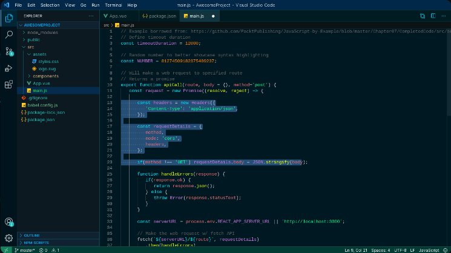
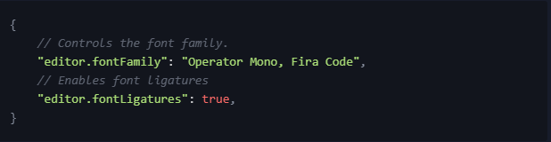

# README
## Hi!!
### This is Astra Dark Theme. This is a test version. We do our best to make this theme one of the best theme for VS Code editor. Hope you guys enjoy the Beta Version.
 

  

## Theme Screenshot
### Default Official Theme (Beta)
 

  

 

## Recommended settings for a better experience
 

  

### Resources
* [Marketplace](http://code.visualstudio.com/docs/languages/markdown)
* [Repository](https://github.com/flickaim135/Astra_Dark_Theme)

### More Info
Released: 09/12/2021
 
Update Status: Beta Version (0.0.1)

# Astra Dark Theme

Copyright © 2021 Dark Astra
